# Gamerfie - Game Collection & Progress Tracking Platform

## Overview

Gamerfie is a modern web application for gamers to track their game collection, progress, and engage with the gaming community. Built with Next.js, TypeScript, and Supabase, it offers a rich set of features for managing your gaming journey.

## Project Structure

```
gamerfie/
├── app/                    # Next.js app directory
│   ├── api/               # API routes
│   ├── game/              # Game-specific pages
│   ├── profile/           # Profile pages
│   └── settings/          # Settings pages
├── components/            # React components
│   ├── game/             # Game-related components
│   ├── profile/          # Profile components
│   └── ui/               # Reusable UI components
├── hooks/                 # Custom React hooks
├── stores/               # Zustand state management
├── types/                # TypeScript type definitions
└── utils/                # Utility functions
```

## Key Features

### Game Management

- Track game progress and completion status
- Manage game collection with different statuses (Playing, Completed, Want to Play, Dropped)
- Track achievements and playtime
- View detailed game information and media

### Profile System

- Customizable user profiles
- Game collection display
- Progress tracking
- Activity feed

### Social Features

- Community stats
- Game reviews and ratings
- Friend system
- Activity sharing

### Challenges

- Participate in gaming challenges
- Track challenge progress
- Various challenge types (completion, genre-specific, etc.)

## Application Flow

### Authentication Flow

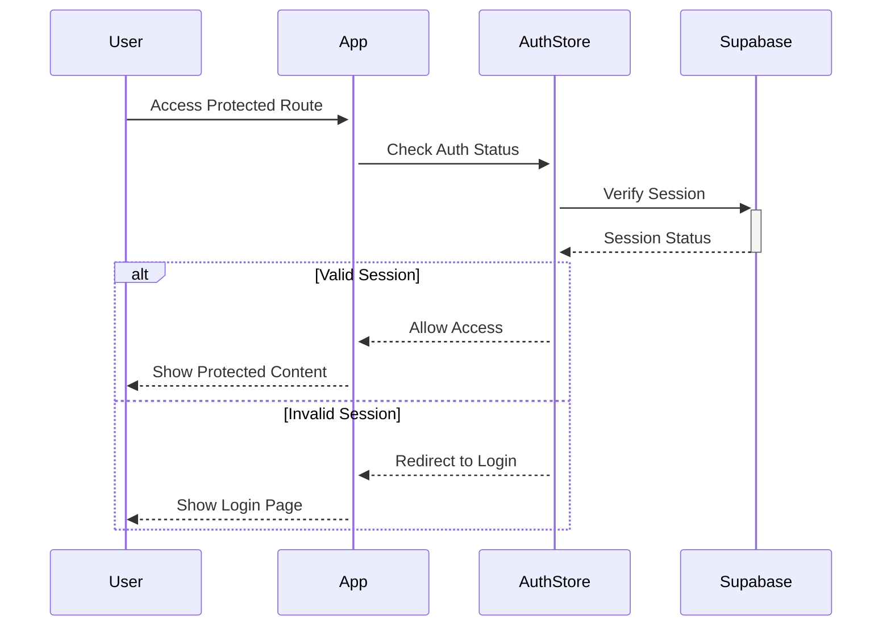

### Game Progress Update Flow

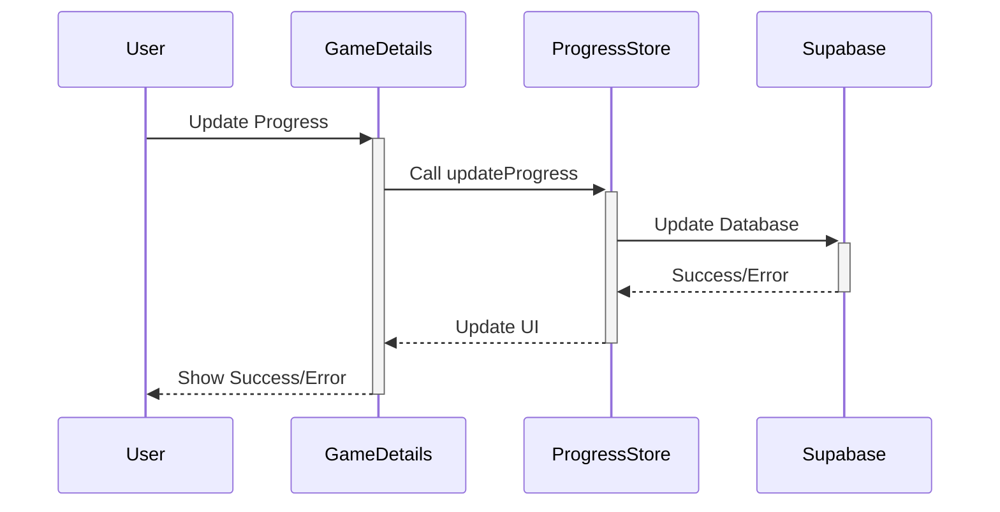

### Game Library Management Flow

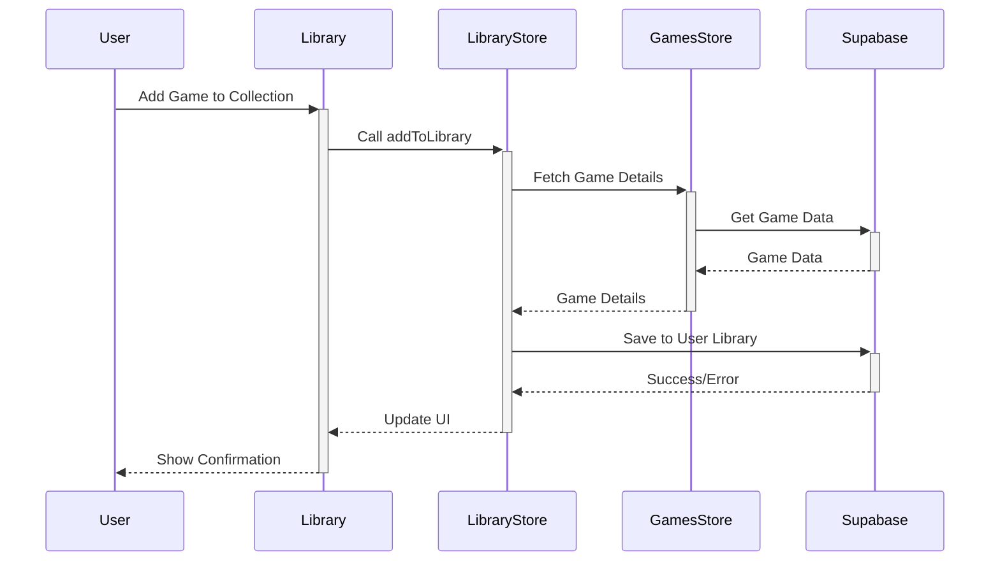

### Achievement Unlock Flow

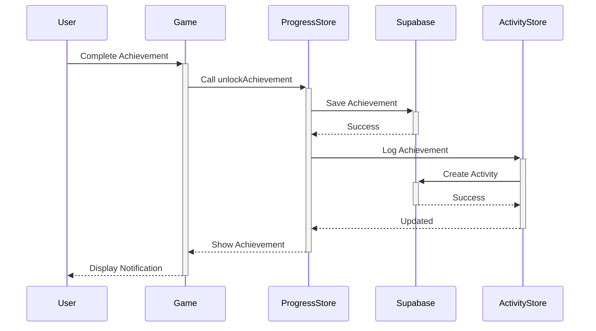

### Friend System Flow

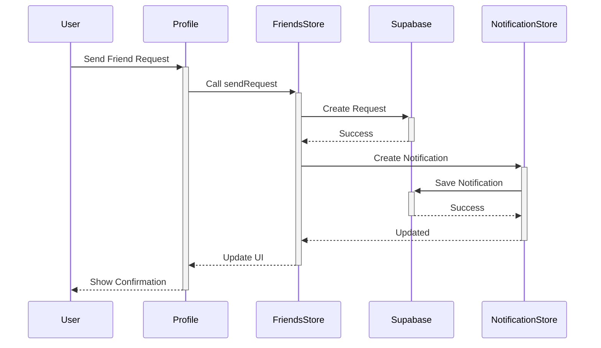

### Challenge Participation Flow

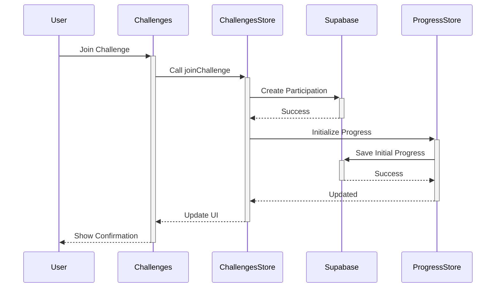

### Data Synchronization Flow

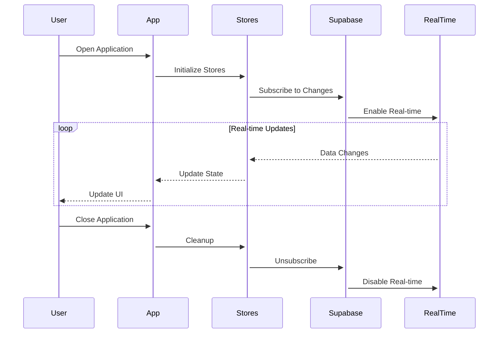

### Error Handling Flow

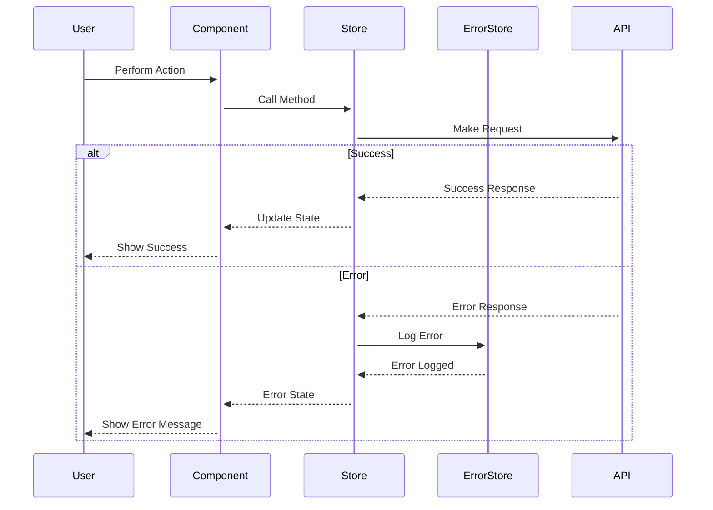

### State Management Flow

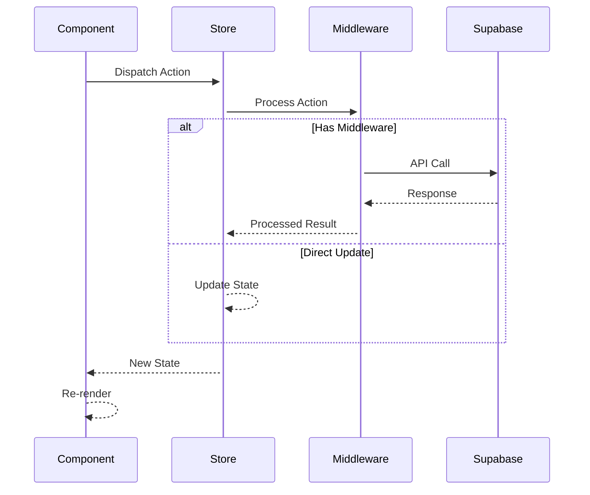

## State Management

The application uses Zustand for state management with several stores:

### Store Examples

#### Auth Store

```typescript
// stores/useAuthStore.ts
import { create } from "zustand";
import { User } from "@/types/user";

interface AuthState {
  user: User | null;
  isLoading: boolean;
  error: string | null;

  setUser: (user: User | null) => void;
  signOut: () => Promise<void>;
  updateProfile: (updates: Partial<User>) => Promise<void>;
}

export const useAuthStore = create<AuthState>((set) => ({
  user: null,
  isLoading: true,
  error: null,

  setUser: (user) => set({ user, isLoading: false }),

  signOut: async () => {
    const supabase = createClientSupabaseClient();
    await supabase.auth.signOut();
    set({ user: null });
  },

  updateProfile: async (updates) => {
    try {
      const supabase = createClientSupabaseClient();
      const { error } = await supabase
        .from("profiles")
        .update(updates)
        .eq("id", updates.id);

      if (error) throw error;
      set((state) => ({
        user: state.user ? { ...state.user, ...updates } : null,
      }));
    } catch (error) {
      set({ error: error.message });
    }
  },
}));
```

#### Progress Store

```typescript
// stores/useProgressStore.ts
interface ProgressState {
  gameProgress: Record<
    string,
    {
      playTime: number;
      completionPercentage: number;
      achievements: Achievement[];
      lastPlayed: string;
    }
  >;

  updateProgress: (
    gameId: string,
    updates: Partial<GameProgress>
  ) => Promise<void>;
  fetchProgress: (gameId: string) => Promise<void>;
  resetProgress: (gameId: string) => Promise<void>;
}

export const useProgressStore = create<ProgressState>()((set, get) => ({
  gameProgress: {},

  updateProgress: async (gameId, updates) => {
    try {
      const supabase = createClientSupabaseClient();
      const { error } = await supabase.from("game_progress").upsert({
        game_id: gameId,
        ...updates,
        updated_at: new Date().toISOString(),
      });

      if (error) throw error;

      set((state) => ({
        gameProgress: {
          ...state.gameProgress,
          [gameId]: {
            ...state.gameProgress[gameId],
            ...updates,
          },
        },
      }));
    } catch (error) {
      console.error("Failed to update progress:", error);
    }
  },
}));
```

#### Friends Store

```typescript
// stores/useFriendsStore.ts
interface FriendsState {
  friends: Friend[];
  pendingRequests: FriendRequest[];
  isLoading: boolean;

  sendFriendRequest: (userId: string) => Promise<void>;
  acceptFriendRequest: (requestId: string) => Promise<void>;
  removeFriend: (friendId: string) => Promise<void>;
}

export const useFriendsStore = create<FriendsState>()((set, get) => ({
  friends: [],
  pendingRequests: [],
  isLoading: false,

  sendFriendRequest: async (userId) => {
    set({ isLoading: true });
    try {
      const supabase = createClientSupabaseClient();
      const { error } = await supabase
        .from("friend_requests")
        .insert({ to_user_id: userId });

      if (error) throw error;
    } catch (error) {
      console.error("Failed to send friend request:", error);
    } finally {
      set({ isLoading: false });
    }
  },
}));
```

## Complete Store Documentation

### Game Details Store

```typescript
// stores/useGameDetailsStore.ts
interface GameDetailsState {
  selectedGame: Game | null;
  isLoading: boolean;
  error: string | null;

  setSelectedGame: (game: Game | null) => void;
  fetchGameDetails: (gameId: string) => Promise<void>;
  updateGameDetails: (updates: Partial<Game>) => Promise<void>;
  clearGameDetails: () => void;
}

export const useGameDetailsStore = create<GameDetailsState>((set) => ({
  selectedGame: null,
  isLoading: false,
  error: null,

  setSelectedGame: (game) => set({ selectedGame: game }),

  fetchGameDetails: async (gameId) => {
    set({ isLoading: true, error: null });
    try {
      const supabase = createClientSupabaseClient();
      const { data, error } = await supabase
        .from("games")
        .select("*, achievements(*)")
        .eq("id", gameId)
        .single();

      if (error) throw error;
      set({ selectedGame: data, isLoading: false });
    } catch (error) {
      set({ error: error.message, isLoading: false });
    }
  },

  clearGameDetails: () => set({ selectedGame: null, error: null }),
}));
```

### Games Store

```typescript
// stores/useGamesStore.ts
interface GamesState {
  games: Game[];
  filters: {
    platform: string;
    genre: string;
    status: GameStatus | "all";
    search: string;
  };
  sorting: {
    field: "name" | "rating" | "releaseDate";
    direction: "asc" | "desc";
  };
  pagination: {
    page: number;
    limit: number;
    total: number;
  };

  setFilters: (filters: Partial<GamesState["filters"]>) => void;
  setSorting: (sorting: GamesState["sorting"]) => void;
  fetchGames: () => Promise<void>;
  fetchUserGames: (userId: string) => Promise<void>;
}

export const useGamesStore = create<GamesState>((set, get) => ({
  games: [],
  filters: {
    platform: "all",
    genre: "all",
    status: "all",
    search: "",
  },
  sorting: {
    field: "name",
    direction: "asc",
  },
  pagination: {
    page: 1,
    limit: 20,
    total: 0,
  },

  setFilters: (filters) =>
    set((state) => ({
      filters: { ...state.filters, ...filters },
      pagination: { ...state.pagination, page: 1 },
    })),

  setSorting: (sorting) => set({ sorting }),

  fetchGames: async () => {
    const { filters, sorting, pagination } = get();
    // Implementation
  },
}));
```

### Library Store

```typescript
// stores/useLibraryStore.ts
interface LibraryState {
  userGames: UserGame[];
  collections: Collection[];
  stats: LibraryStats;

  addToLibrary: (game: Game, status: GameStatus) => Promise<void>;
  removeFromLibrary: (gameId: string) => Promise<void>;
  updateGameStatus: (gameId: string, status: GameStatus) => Promise<void>;
  createCollection: (collection: Partial<Collection>) => Promise<void>;
  addToCollection: (gameId: string, collectionId: string) => Promise<void>;
}

export const useLibraryStore = create<LibraryState>((set, get) => ({
  userGames: [],
  collections: [],
  stats: {
    totalGames: 0,
    byStatus: {},
    byPlatform: {},
    totalPlaytime: 0,
  },

  addToLibrary: async (game, status) => {
    // Implementation
  },

  updateGameStatus: async (gameId, status) => {
    // Implementation
  },
}));
```

### Progress Store

```typescript
// stores/useProgressStore.ts
interface ProgressState {
  gameProgress: Record<string, GameProgress>;
  achievementProgress: Record<string, AchievementProgress[]>;

  updateProgress: (
    gameId: string,
    updates: Partial<GameProgress>
  ) => Promise<void>;
  unlockAchievement: (gameId: string, achievementId: string) => Promise<void>;
  updateAchievementProgress: (
    gameId: string,
    achievementId: string,
    progress: number
  ) => Promise<void>;
  resetProgress: (gameId: string) => Promise<void>;
}

export const useProgressStore = create<ProgressState>((set, get) => ({
  gameProgress: {},
  achievementProgress: {},

  updateProgress: async (gameId, updates) => {
    // Implementation
  },
}));
```

### Friends Store

```typescript
// stores/useFriendsStore.ts
interface FriendsState {
  friends: Friend[];
  pendingRequests: FriendRequest[];
  blockedUsers: string[];

  sendFriendRequest: (userId: string) => Promise<void>;
  acceptFriendRequest: (requestId: string) => Promise<void>;
  rejectFriendRequest: (requestId: string) => Promise<void>;
  removeFriend: (friendId: string) => Promise<void>;
  blockUser: (userId: string) => Promise<void>;
}

export const useFriendsStore = create<FriendsState>((set, get) => ({
  friends: [],
  pendingRequests: [],
  blockedUsers: [],

  sendFriendRequest: async (userId) => {
    // Implementation
  },
}));
```

### UI Store

```typescript
// stores/useUIStore.ts
interface UIState {
  theme: "light" | "dark" | "system";
  sidebarOpen: boolean;
  modals: {
    addGame: boolean;
    editProgress: boolean;
    friendRequest: boolean;
  };

  setTheme: (theme: UIState["theme"]) => void;
  toggleSidebar: () => void;
  openModal: (modal: keyof UIState["modals"]) => void;
  closeModal: (modal: keyof UIState["modals"]) => void;
}

export const useUIStore = create<UIState>((set) => ({
  theme: "system",
  sidebarOpen: true,
  modals: {
    addGame: false,
    editProgress: false,
    friendRequest: false,
  },

  setTheme: (theme) => set({ theme }),
}));
```

## Complete Supabase Schema

```sql
-- Authentication and Users
create table public.profiles (
  id uuid references auth.users on delete cascade primary key,
  username text unique not null,
  email text unique not null,
  avatar_url text,
  bio text,
  location text,
  website text,
  social_links jsonb,
  preferences jsonb default '{
    "theme": "system",
    "notifications": {
      "email": true,
      "push": true,
      "friendRequests": true
    }
  }'::jsonb,
  created_at timestamp with time zone default now(),
  updated_at timestamp with time zone default now()
);

-- Games and Media
create table public.games (
  id uuid primary key default uuid_generate_v4(),
  name text not null,
  description text,
  cover_url text,
  background_url text,
  release_date timestamp with time zone,
  developer text,
  publisher text,
  platforms text[] default '{}',
  genres text[] default '{}',
  tags text[] default '{}',
  rating numeric(3,1),
  metacritic_score integer,
  total_rating_count integer default 0,
  total_rating_sum integer default 0,
  created_at timestamp with time zone default now(),
  updated_at timestamp with time zone default now()
);

create table public.game_media (
  id uuid primary key default uuid_generate_v4(),
  game_id uuid references public.games on delete cascade,
  type text check (type in ('screenshot', 'video', 'artwork')),
  url text not null,
  thumbnail_url text,
  width integer,
  height integer,
  created_at timestamp with time zone default now()
);

-- User Games and Progress
create table public.user_games (
  id uuid primary key default uuid_generate_v4(),
  user_id uuid references auth.users on delete cascade,
  game_id uuid references public.games on delete cascade,
  status text check (status in ('playing', 'completed', 'want_to_play', 'dropped')),
  platform text,
  play_time integer default 0,
  completion_percentage integer check (completion_percentage between 0 and 100),
  rating integer check (rating between 1 and 10),
  review text,
  review_updated_at timestamp with time zone,
  last_played_at timestamp with time zone,
  created_at timestamp with time zone default now(),
  updated_at timestamp with time zone default now(),
  unique(user_id, game_id)
);

create table public.game_sessions (
  id uuid primary key default uuid_generate_v4(),
  user_id uuid references auth.users on delete cascade,
  game_id uuid references public.games on delete cascade,
  start_time timestamp with time zone not null,
  end_time timestamp with time zone,
  duration integer,
  platform text,
  notes text,
  created_at timestamp with time zone default now()
);

-- Achievements
create table public.achievements (
  id uuid primary key default uuid_generate_v4(),
  game_id uuid references public.games on delete cascade,
  name text not null,
  description text,
  icon_url text,
  rarity numeric(5,2) default 0,
  points integer default 0,
  is_hidden boolean default false,
  unlock_conditions text,
  created_at timestamp with time zone default now()
);

create table public.user_achievements (
  id uuid primary key default uuid_generate_v4(),
  user_id uuid references auth.users on delete cascade,
  achievement_id uuid references public.achievements on delete cascade,
  game_id uuid references public.games on delete cascade,
  unlocked_at timestamp with time zone default now(),
  platform text,
  created_at timestamp with time zone default now(),
  unique(user_id, achievement_id)
);

-- Social Features
create table public.friend_requests (
  id uuid primary key default uuid_generate_v4(),
  from_user_id uuid references auth.users on delete cascade,
  to_user_id uuid references auth.users on delete cascade,
  status text check (status in ('pending', 'accepted', 'rejected')),
  created_at timestamp with time zone default now(),
  updated_at timestamp with time zone default now(),
  unique(from_user_id, to_user_id)
);

create table public.friends (
  id uuid primary key default uuid_generate_v4(),
  user_id uuid references auth.users on delete cascade,
  friend_id uuid references auth.users on delete cascade,
  created_at timestamp with time zone default now(),
  unique(user_id, friend_id)
);

create table public.blocked_users (
  id uuid primary key default uuid_generate_v4(),
  user_id uuid references auth.users on delete cascade,
  blocked_user_id uuid references auth.users on delete cascade,
  reason text,
  created_at timestamp with time zone default now(),
  unique(user_id, blocked_user_id)
);

-- Activity Feed
create table public.activity (
  id uuid primary key default uuid_generate_v4(),
  user_id uuid references auth.users on delete cascade,
  type text check (type in (
    'game_added',
    'game_status_updated',
    'achievement_unlocked',
    'game_completed',
    'review_added',
    'friend_added'
  )),
  game_id uuid references public.games on delete cascade,
  achievement_id uuid references public.achievements on delete cascade,
  metadata jsonb default '{}'::jsonb,
  created_at timestamp with time zone default now()
);

-- Collections
create table public.collections (
  id uuid primary key default uuid_generate_v4(),
  user_id uuid references auth.users on delete cascade,
  name text not null,
  description text,
  is_public boolean default true,
  cover_url text,
  created_at timestamp with time zone default now(),
  updated_at timestamp with time zone default now()
);

create table public.collection_games (
  id uuid primary key default uuid_generate_v4(),
  collection_id uuid references public.collections on delete cascade,
  game_id uuid references public.games on delete cascade,
  added_at timestamp with time zone default now(),
  unique(collection_id, game_id)
);

-- Challenges
create table public.challenges (
  id uuid primary key default uuid_generate_v4(),
  title text not null,
  description text,
  type text check (type in ('completion', 'achievement', 'playtime', 'custom')),
  goal_type text not null,
  goal_value integer not null,
  start_date timestamp with time zone not null,
  end_date timestamp with time zone not null,
  requirements jsonb default '{}'::jsonb,
  rewards jsonb default '{}'::jsonb,
  created_at timestamp with time zone default now(),
  updated_at timestamp with time zone default now()
);

create table public.user_challenges (
  id uuid primary key default uuid_generate_v4(),
  user_id uuid references auth.users on delete cascade,
  challenge_id uuid references public.challenges on delete cascade,
  progress integer default 0,
  status text check (status in ('active', 'completed', 'failed')),
  completed_at timestamp with time zone,
  created_at timestamp with time zone default now(),
  updated_at timestamp with time zone default now(),
  unique(user_id, challenge_id)
);

-- Indexes
create index idx_user_games_user_id on public.user_games(user_id);
create index idx_user_games_game_id on public.user_games(game_id);
create index idx_achievements_game_id on public.achievements(game_id);
create index idx_user_achievements_user_id on public.user_achievements(user_id);
create index idx_user_achievements_achievement_id on public.user_achievements(achievement_id);
create index idx_activity_user_id on public.activity(user_id);
create index idx_activity_created_at on public.activity(created_at desc);
create index idx_friends_user_id on public.friends(user_id);
create index idx_collections_user_id on public.collections(user_id);
create index idx_challenges_date_range on public.challenges(start_date, end_date);

-- Functions and Triggers
create or replace function update_updated_at()
returns trigger as $$
begin
  new.updated_at = now();
  return new;
end;
$$ language plpgsql;

create trigger set_updated_at
  before update on public.profiles
  for each row
  execute function update_updated_at();

-- Similar triggers for other tables that need updated_at
```

## Component Interactions

### Game Details Flow

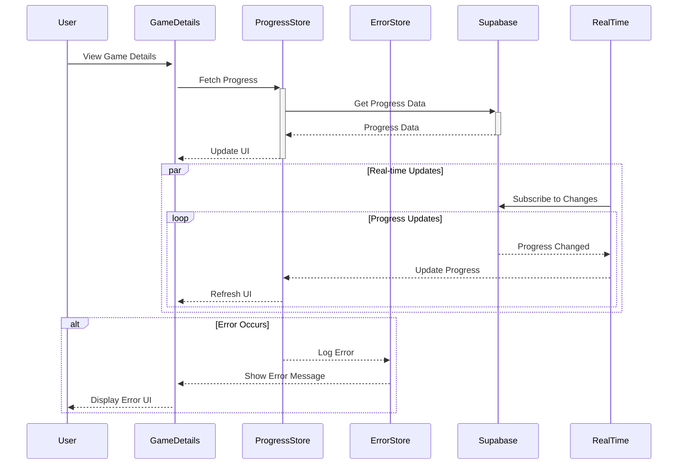

### Game Stats Implementation

The game details page is structured with several key components:

#### Components Structure

```
GameDetails/
├── GameHero/               # Hero section with game info and actions
├── GameTabs/              # Tab navigation for different sections
│   ├── OverviewTab       # Game overview and description
│   ├── StatsTab         # Personal and community stats
│   ├── MediaTab         # Game media gallery
│   ├── AchievementsTab  # Game achievements
│   ├── ChallengesTab   # Related challenges
│   ├── ActivityTab     # Game activity feed
│   └── RelatedTab      # Related games
└── ErrorBoundary       # Error handling wrapper

```

#### Stats Features

- Personal Stats

  - Total playtime tracking
  - Completion percentage
  - Achievement progress
  - Progress rate calculation
  - Historical data visualization
    - Playtime history graph
    - Achievement unlock timeline
    - Completion progress chart

- Community Stats
  - Total players count
  - Active players tracking
  - Average completion rate
  - Average playtime statistics
  - Community activity feed

#### Real-time Updates

The game details implement real-time synchronization:

```typescript
// Subscribe to progress updates
const progressSubscription = supabase
  .channel("game_progress")
  .on(
    "postgres_changes",
    {
      event: "*",
      schema: "public",
      table: "user_games",
      filter: `game_id=eq.${gameId}`,
    },
    (payload) => {
      // Refresh progress data
      fetchProgress(userId, gameId);
    }
  )
  .subscribe();
```

#### Error Handling

Errors are managed through a centralized ErrorStore:

```typescript
interface ErrorState {
  errors: Array<{
    id: string;
    type: ErrorType;
    message: string;
    timestamp: number;
  }>;
  addError: (type: ErrorType, message: string) => void;
  removeError: (id: string) => void;
  clearErrors: () => void;
}
```

#### State Management

Game details state is managed through several stores:

- ProgressStore: Handles game progress and stats
- ActivityStore: Manages game activities
- ErrorStore: Centralizes error handling
- UIStore: Manages UI state and animations

#### UI Components

The stats tab includes several visualization components:

```typescript
interface GameStatsProps {
  playTime: number;
  completionPercentage: number;
  achievementsCompleted: number;
  totalAchievements: number;
  playTimeHistory: Array<{ date: string; hours: number }>;
  achievementHistory: Array<{ date: string; count: number }>;
}
```

These components use Recharts for data visualization:

- Line charts for playtime history
- Bar charts for achievement progress
- Pie charts for completion breakdown
- Progress indicators for quick stats

### Profile System Flow

```typescript
// components/profile/profile-page.tsx
export function ProfilePage({ userId }: { userId: string }) {
  const { user } = useAuthStore();
  const { games, fetchUserGames } = useGamesStore();
  const { friends, fetchFriends } = useFriendsStore();

  useEffect(() => {
    fetchUserGames(userId);
    fetchFriends(userId);
  }, [userId]);

  return (
    <div>
      <ProfileHeader
        user={user}
        gamesCount={games.length}
        friendsCount={friends.length}
      />
      <Tabs defaultValue="games">
        <TabsList>
          <TabsTrigger value="games">Games</TabsTrigger>
          <TabsTrigger value="friends">Friends</TabsTrigger>
          <TabsTrigger value="activity">Activity</TabsTrigger>
        </TabsList>
        <TabsContent value="games">
          <GameCollection games={games} />
        </TabsContent>
        <TabsContent value="friends">
          <FriendsList friends={friends} />
        </TabsContent>
        <TabsContent value="activity">
          <ActivityFeed userId={userId} />
        </TabsContent>
      </Tabs>
    </div>
  );
}
```

## Type Definitions

### Base Types

```typescript
// types/base.ts
export type UUID = string;
export type ISO8601DateTime = string;
export type UnixTimestamp = number;

export interface BaseEntity {
  id: UUID;
  created_at: ISO8601DateTime;
  updated_at: ISO8601DateTime;
}

export interface PaginationParams {
  page?: number;
  limit?: number;
  cursor?: string;
}

export interface PaginatedResponse<T> {
  data: T[];
  metadata: {
    total: number;
    hasMore: boolean;
    nextCursor?: string;
  };
}
```

### User Types

```typescript
// types/user.ts
import { BaseEntity } from "./base";

export interface User extends BaseEntity {
  username: string;
  email: string;
  avatar_url?: string;
  bio?: string;
  settings: UserSettings;
  stats: UserStats;
}

export interface UserSettings {
  theme: "light" | "dark" | "system";
  notifications: {
    email: boolean;
    push: boolean;
    friendRequests: boolean;
    achievements: boolean;
  };
  privacy: {
    profileVisibility: "public" | "friends" | "private";
    activityVisibility: "public" | "friends" | "private";
    libraryVisibility: "public" | "friends" | "private";
  };
}

export interface UserStats {
  totalGames: number;
  completedGames: number;
  totalPlaytime: number;
  achievementCount: number;
  completionRate: number;
  averagePlaytime: number;
}
```

### Game Types

```typescript
// types/game.ts
import { BaseEntity } from "./base";

export type GameStatus = "playing" | "completed" | "want_to_play" | "dropped";
export type GamePlatform =
  | "pc"
  | "playstation"
  | "xbox"
  | "nintendo"
  | "mobile";
export type GameGenre =
  | "action"
  | "rpg"
  | "strategy"
  | "sports"
  | "adventure"
  | "simulation";

export interface Game extends BaseEntity {
  name: string;
  description: string;
  cover_url?: string;
  background_url?: string;
  release_date?: ISO8601DateTime;
  developer: string;
  publisher: string;
  platforms: GamePlatform[];
  genres: GameGenre[];
  rating?: number;
  metacritic_score?: number;
  achievements?: Achievement[];
  media: GameMedia[];
  stats: GameStats;
}

export interface GameMedia {
  type: "screenshot" | "video" | "artwork";
  url: string;
  thumbnail_url?: string;
  width: number;
  height: number;
}

export interface GameStats {
  total_players: number;
  active_players: number;
  completion_rate: number;
  average_playtime: number;
  achievement_unlock_rate: number;
}

export interface UserGame extends BaseEntity {
  user_id: UUID;
  game_id: UUID;
  status: GameStatus;
  play_time: number;
  last_played_at?: ISO8601DateTime;
  completion_percentage?: number;
  user_rating?: number;
  review?: string;
  platform: GamePlatform;
  achievements_unlocked: number;
}
```

### Achievement Types

```typescript
// types/achievement.ts
import { BaseEntity } from "./base";

export interface Achievement extends BaseEntity {
  game_id: UUID;
  name: string;
  description: string;
  icon_url: string;
  rarity: number;
  points: number;
  is_hidden: boolean;
  unlock_conditions?: string;
}

export interface UserAchievement extends BaseEntity {
  user_id: UUID;
  achievement_id: UUID;
  game_id: UUID;
  unlocked_at: ISO8601DateTime;
  unlock_platform: GamePlatform;
}

export interface AchievementProgress {
  achievement_id: UUID;
  progress: number;
  current_value: number;
  target_value: number;
  updated_at: ISO8601DateTime;
}
```

## API Integration

### Route Handlers

```typescript
// app/api/games/route.ts
import { createRouteHandlerClient } from "@supabase/auth-helpers-nextjs";
import { cookies } from "next/headers";
import { NextResponse } from "next/server";
import { PaginationParams, PaginatedResponse } from "@/types/base";
import { Game } from "@/types/game";

export async function GET(request: Request) {
  const { searchParams } = new URL(request.url);
  const pagination: PaginationParams = {
    page: parseInt(searchParams.get("page") || "1"),
    limit: parseInt(searchParams.get("limit") || "20"),
  };

  const filters = {
    platform: searchParams.get("platform"),
    genre: searchParams.get("genre"),
    status: searchParams.get("status"),
    search: searchParams.get("search"),
  };

  const supabase = createRouteHandlerClient({ cookies });
  let query = supabase.from("games").select("*", { count: "exact" });

  // Apply filters
  if (filters.platform) {
    query = query.contains("platforms", [filters.platform]);
  }
  if (filters.genre) {
    query = query.contains("genres", [filters.genre]);
  }
  if (filters.search) {
    query = query.ilike("name", `%${filters.search}%`);
  }

  // Apply pagination
  const from = (pagination.page - 1) * pagination.limit;
  query = query.range(from, from + pagination.limit - 1);

  const { data, error, count } = await query;

  if (error) {
    return NextResponse.json(
      { error: "Failed to fetch games" },
      { status: 500 }
    );
  }

  const response: PaginatedResponse<Game> = {
    data,
    metadata: {
      total: count || 0,
      hasMore: from + pagination.limit < (count || 0),
      nextCursor:
        from + pagination.limit < (count || 0)
          ? (pagination.page + 1).toString()
          : undefined,
    },
  };

  return NextResponse.json(response);
}

export async function POST(request: Request) {
  const supabase = createRouteHandlerClient({ cookies });
  const game = await request.json();

  const { data, error } = await supabase
    .from("games")
    .insert(game)
    .select()
    .single();

  if (error) {
    return NextResponse.json(
      { error: "Failed to create game" },
      { status: 500 }
    );
  }

  return NextResponse.json(data);
}
```

### API Utilities

```typescript
// utils/api.ts
import { PaginationParams } from "@/types/base";

export class APIError extends Error {
  constructor(message: string, public status: number, public code?: string) {
    super(message);
    this.name = "APIError";
  }
}

export async function fetchAPI<T>(
  endpoint: string,
  options: RequestInit = {}
): Promise<T> {
  const response = await fetch(`/api/${endpoint}`, {
    ...options,
    headers: {
      "Content-Type": "application/json",
      ...options.headers,
    },
  });

  const data = await response.json();

  if (!response.ok) {
    throw new APIError(
      data.error || "An error occurred",
      response.status,
      data.code
    );
  }

  return data;
}

export function buildQueryString(
  params: Record<string, string | number | boolean | undefined>
): string {
  const searchParams = new URLSearchParams();

  Object.entries(params).forEach(([key, value]) => {
    if (value !== undefined) {
      searchParams.append(key, value.toString());
    }
  });

  return searchParams.toString();
}
```

### API Hooks

```typescript
// hooks/useGames.ts
import { useQuery, useMutation, useQueryClient } from "@tanstack/react-query";
import { fetchAPI } from "@/utils/api";
import { Game, UserGame } from "@/types/game";
import { PaginationParams, PaginatedResponse } from "@/types/base";

interface UseGamesOptions {
  pagination?: PaginationParams;
  filters?: {
    platform?: string;
    genre?: string;
    status?: string;
    search?: string;
  };
}

export function useGames(options: UseGamesOptions = {}) {
  const queryString = buildQueryString({
    page: options.pagination?.page,
    limit: options.pagination?.limit,
    ...options.filters,
  });

  return useQuery<PaginatedResponse<Game>>({
    queryKey: ["games", queryString],
    queryFn: () => fetchAPI(`games?${queryString}`),
  });
}

export function useUpdateGameProgress() {
  const queryClient = useQueryClient();

  return useMutation({
    mutationFn: async ({
      gameId,
      progress,
    }: {
      gameId: string;
      progress: Partial<UserGame>;
    }) => {
      return fetchAPI(`games/${gameId}/progress`, {
        method: "PATCH",
        body: JSON.stringify(progress),
      });
    },
    onSuccess: (_, { gameId }) => {
      queryClient.invalidateQueries({ queryKey: ["games", gameId] });
      queryClient.invalidateQueries({ queryKey: ["userGames"] });
    },
  });
}
```

## Database Schema

### Key Tables

```sql
-- Example Supabase schema
create table public.games (
  id uuid primary key default uuid_generate_v4(),
  name text not null,
  cover_url text,
  release_date timestamp with time zone,
  rating numeric(3,1),
  created_at timestamp with time zone default now()
);

create table public.user_games (
  id uuid primary key default uuid_generate_v4(),
  user_id uuid references auth.users(id) on delete cascade,
  game_id uuid references public.games(id) on delete cascade,
  status text check (status in ('playing', 'completed', 'want_to_play', 'dropped')),
  play_time integer default 0,
  completion_percentage integer,
  created_at timestamp with time zone default now(),
  unique(user_id, game_id)
);
```

## Setup Instructions

1. **Prerequisites**

   - Node.js (v16 or higher)
   - npm or yarn
   - Supabase account

2. **Environment Setup**

   ```bash
   # Clone the repository
   git clone [repository-url]
   cd gamerfie

   # Install dependencies
   npm install

   # Set up environment variables
   cp .env.example .env.local
   ```

3. **Environment Variables**

   ```
   NEXT_PUBLIC_SUPABASE_URL=your-supabase-url
   NEXT_PUBLIC_SUPABASE_ANON_KEY=your-supabase-anon-key
   ```

4. **Database Setup**

   - Set up your Supabase database
   - Run the provided migration scripts
   - Set up authentication providers

5. **Development**
   ```bash
   # Start development server
   npm run dev
   ```

## Key Components

### Game Details

The `GameDetails` component (`components/game-details.tsx`) is the central component for displaying game information, including:

- Game cover and background images
- Progress tracking
- Achievement tracking
- Community stats
- Screenshots and media

### Profile System

The profile system (`components/profile/`) includes:

- Profile header with user information
- Games tab for collection display
- Activity feed
- Stats and achievements

### Game Filters

The filtering system (`components/profile/game-filters.tsx`) allows users to:

- Filter by game status
- Sort by different criteria
- Toggle between grid and list views

## Styling

The project uses:

- Tailwind CSS for styling
- Shadcn UI components
- Custom UI components in `components/ui/`
- Responsive design for mobile and desktop

## Development Guidelines

1. **Component Structure**

   - Use TypeScript for type safety
   - Implement proper error handling
   - Follow the established component patterns

2. **State Management**

   - Use Zustand stores for global state
   - Implement proper loading and error states
   - Handle data fetching efficiently

3. **Performance**

   - Implement proper memoization
   - Use optimistic updates where appropriate
   - Implement proper loading states

4. **Testing**
   - Write unit tests for critical functionality
   - Test components in isolation
   - Ensure proper error handling

## Deployment

1. **Build**

   ```bash
   npm run build
   ```

2. **Production**

   ```bash
   npm start
   ```

3. **Deployment Platforms**
   - Vercel (recommended)
   - Netlify
   - Custom server

## Contributing

1. Fork the repository
2. Create a feature branch
3. Make your changes
4. Submit a pull request

## Troubleshooting

Common issues and solutions:

1. **Database Connection Issues**

   - Check Supabase credentials
   - Verify environment variables

2. **Build Errors**

   - Clear `.next` directory
   - Verify dependencies
   - Check TypeScript errors

3. **State Management Issues**
   - Check Zustand store implementation
   - Verify store subscriptions
   - Debug with React DevTools

## Resources

- [Next.js Documentation](https://nextjs.org/docs)
- [Supabase Documentation](https://supabase.io/docs)
- [Zustand Documentation](https://github.com/pmndrs/zustand)
- [Tailwind CSS Documentation](https://tailwindcss.com/docs)

## Profile Pages Structure

Each profile page follows a consistent layout structure:

```tsx
// Profile Page Layout
<div className="flex flex-col min-h-screen">
  {/* Profile Header - Common across all profile pages */}
  <ProfileHeader
    profile={profile}
    stats={gameStats}
    onProfileUpdate={handleProfileUpdate}
  />

  {/* Profile Navigation - Common across all profile pages */}
  <div className="sticky top-16 z-40 bg-gray-950/90 backdrop-blur-md border-b border-white/10">
    <ProfileNav />
  </div>

  {/* Page-specific Content */}
  <div className="flex-grow bg-gradient-to-b from-gray-950 to-gray-900">
    <div className="max-w-7xl mx-auto px-4 py-12">
      {/* Page-specific components */}
    </div>
  </div>
</div>
```

### Profile Games Page Implementation

The games page (`/profile/games`) demonstrates the standard profile page structure while adding game-specific functionality:

```tsx
// app/profile/games/page.tsx
export default function GamesPage() {
  // State management
  const { profile, isLoading, error, gameStats } = useProfile();
  const [filters, setFilters] = useState<GameFiltersType>({
    status: "all",
    sortBy: "recent",
    sortOrder: "desc",
  });

  // Loading state
  if (isLoading) {
    return <LoadingState />;
  }

  // Error handling
  if (error || !profile || !gameStats) {
    return <ErrorState error={error?.message || "Profile not found"} />;
  }

  return (
    <div className="flex flex-col min-h-screen">
      {/* Common Profile Components */}
      <ProfileHeader
        profile={profile}
        stats={gameStats}
        onProfileUpdate={() => {}}
      />
      <ProfileNav />

      {/* Games-specific Content */}
      <div className="flex-grow bg-gradient-to-b from-gray-950 to-gray-900">
        <div className="max-w-7xl mx-auto px-4 py-12">
          <div className="flex flex-col space-y-8">
            <GameFilters onFilterChange={setFilters} />
            <GamesTab filters={filters} />
          </div>
        </div>
      </div>
    </div>
  );
}
```

### Key Components

#### ProfileHeader

- Displays user avatar, name, and bio
- Shows game statistics and achievements
- Handles profile updates

#### ProfileNav

- Provides navigation between profile sections
- Highlights current active section
- Responsive design for mobile and desktop

#### GameFilters

- Allows filtering games by status (Playing, Completed, etc.)
- Provides sorting options (Recent, Name, Rating)
- Maintains filter state for the game list

#### GamesTab

- Displays the filtered game list
- Supports grid and list view modes
- Handles game status updates
- Shows game progress and completion stats

### State Management Flow

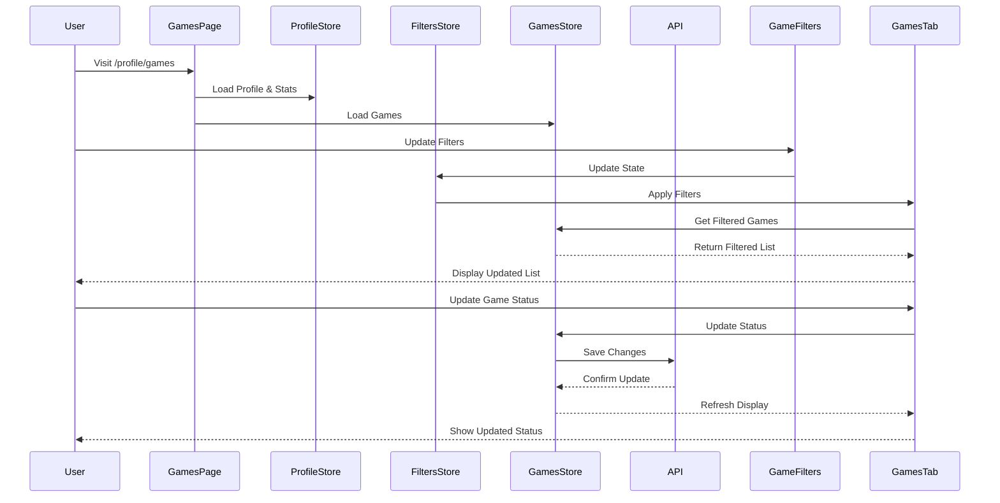

### Game Details Navigation

The games list in the profile section (`components/profile/games-tab.tsx`) implements navigation to individual game detail pages:

```tsx
// List View Component with Navigation
const GameListItem = ({ game }: { game: GameWithUserData }) => {
  const router = useRouter();

  return (
    <motion.div
      onClick={() => router.push(`/game/${game.game_id}`)}
      className="group cursor-pointer ..."
    >
      {/* Game item content */}
    </motion.div>
  );
};

// Grid View Component with Navigation
const GameGridItem = ({ game }: { game: GameWithUserData }) => {
  const router = useRouter();

  return (
    <motion.div
      onClick={() => router.push(`/game/${game.game_id}`)}
      className="group cursor-pointer ..."
    >
      {/* Game item content */}
    </motion.div>
  );
};
```

#### Navigation Flow

1. User clicks on a game in their profile's game list
2. Application navigates to `/game/[id]` using Next.js router
3. Game details page loads with the full game information
4. Maintains consistent profile layout while showing game-specific content

#### Implementation Details

- Uses Next.js `useRouter` for client-side navigation
- Preserves game state and user context during navigation
- Maintains responsive design in both list and grid views
- Handles loading and error states appropriately
- Supports both mouse and keyboard navigation
- Preserves filter and sort states when returning to the games list

### View Toggle Implementation

The games list supports both grid and list views, with a persistent user preference:

```tsx
// app/profile/games/page.tsx
export default function GamesPage() {
  const { libraryView, setLibraryView } = useSettingsStore();

  return (
    <div className="flex justify-between items-center">
      <GameFilters onFilterChange={setFilters} />
      <div className="flex gap-2">
        <Button
          variant={libraryView === "grid" ? "default" : "outline"}
          size="icon"
          onClick={() => setLibraryView("grid")}
        >
          <LayoutGrid className="h-4 w-4" />
        </Button>
        <Button
          variant={libraryView === "list" ? "default" : "outline"}
          size="icon"
          onClick={() => setLibraryView("list")}
        >
          <List className="h-4 w-4" />
        </Button>
      </div>
    </div>
  );
}
```

#### View State Management

The view preference is managed through the settings store:

```tsx
// stores/useSettingsStore.ts
interface SettingsState {
  libraryView: "grid" | "list";
  setLibraryView: (view: "grid" | "list") => void;
}

export const useSettingsStore = create<SettingsState>()(
  persist(
    (set) => ({
      libraryView: "grid",
      setLibraryView: (view) => set({ libraryView: view }),
    }),
    {
      name: "settings-storage",
    }
  )
);
```

#### Grid View Image Quality

The grid view implements high-quality image rendering with optimized loading:

```tsx
// components/profile/games-tab.tsx
const GameGridItem = ({ game }: { game: GameWithUserData }) => (
  <Image
    src={game.game.cover_url.replace(/t_[a-zA-Z_]+/, "t_cover_big_2x")}
    alt={game.game.name}
    fill
    sizes="(max-width: 768px) 50vw, (max-width: 1200px) 33vw, 25vw"
    quality={90}
    priority={true}
    className="object-cover transition-transform duration-300 group-hover:scale-105"
  />
);
```

Key features:

- Uses high-resolution cover images (`t_cover_big_2x`)
- Responsive image sizing with `sizes` attribute
- High image quality setting (90%)
- Priority loading for visible images
- Smooth hover transitions
- Fallback for missing cover images

#### Responsive Grid Layout

The grid adapts to different screen sizes:

```tsx
<div className="grid grid-cols-1 gap-6 md:grid-cols-2 lg:grid-cols-3 xl:grid-cols-4">
  {sortedGames.map((game) => (
    <GameGridItem key={game.game_id} game={game} />
  ))}
</div>
```

Breakpoints:

- Mobile: 1 column
- Tablet: 2 columns
- Desktop: 3 columns
- Large Desktop: 4 columns
